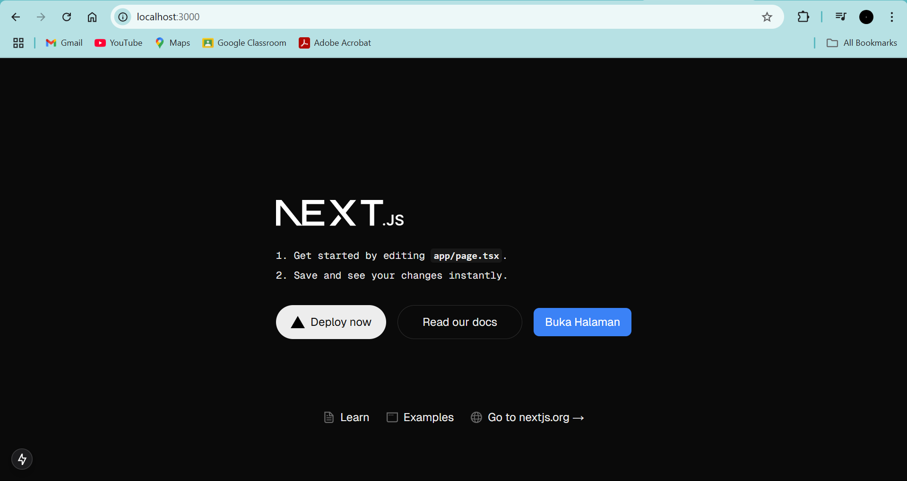

This is a [Next.js](https://nextjs.org) project bootstrapped with [`create-next-app`](https://nextjs.org/docs/app/api-reference/cli/create-next-app).

## Getting Started

First, run the development server:

```bash
npm run dev
# or
yarn dev
# or
pnpm dev
# or
bun dev
```

Open [http://localhost:3000](http://localhost:3000) with your browser to see the result.

You can start editing the page by modifying `app/page.tsx`. The page auto-updates as you edit the file.

This project uses [`next/font`](https://nextjs.org/docs/app/building-your-application/optimizing/fonts) to automatically optimize and load [Geist](https://vercel.com/font), a new font family for Vercel.

## Learn More

To learn more about Next.js, take a look at the following resources:

- [Next.js Documentation](https://nextjs.org/docs) - learn about Next.js features and API.
- [Learn Next.js](https://nextjs.org/learn) - an interactive Next.js tutorial.

You can check out [the Next.js GitHub repository](https://github.com/vercel/next.js) - your feedback and contributions are welcome!

## Deploy on Vercel

The easiest way to deploy your Next.js app is to use the [Vercel Platform](https://vercel.com/new?utm_medium=default-template&filter=next.js&utm_source=create-next-app&utm_campaign=create-next-app-readme) from the creators of Next.js.

Check out our [Next.js deployment documentation](https://nextjs.org/docs/app/building-your-application/deploying) for more details.

# Laporan Praktikum

## Pemrograman Berbasis Framework 2024

| NIM   | 244107027007          |
|-------|-----------------|  
| Nama  | Ahmad Nana Maingga |  
| Kelas | TI - 4K         |  

---

## Jawaban Soal 1

| Tools   | Kegunaan |  
|---------|------------------------------------------------|  
| **Git** | Mengelola versi kode dan bekerja dengan tim di GitHub. |  
| **VS Code** | Menulis, mengedit, dan menjalankan kode dengan efisien. |  
| **Node.js** | Menjalankan aplikasi berbasis JavaScript seperti React.js. |  

Bukti Screenshot  
  

---

## Jawaban Soal 2

### **1. Istilah dalam Next.js**  

- **TypeScript** → Superset dari JavaScript yang menambahkan **tipe data statis** untuk meningkatkan keamanan dan skalabilitas kode.  
- **ESLint** → Alat analisis statis yang digunakan untuk menjaga kualitas kode dengan mendeteksi kesalahan sintaks atau pola kode yang buruk.  
- **Tailwind CSS** → Framework CSS berbasis utility-first yang memungkinkan styling cepat dengan class yang sudah tersedia.  
- **App Router** → Router baru di Next.js yang berbasis folder `app/`, menggantikan `pages/` untuk arsitektur yang lebih fleksibel.  
- **Import Alias** → Fitur yang memungkinkan kita menggunakan path pendek (`@/components`) daripada path panjang (`../../components`).  
- **Turbopack** → Bundler yang lebih cepat dari Webpack, digunakan oleh Next.js untuk mempercepat build dan hot reload.  

---

### **2. Struktur Folder pada Proyek Next.js**  

| Folder / File | Kegunaan |  
|--------------|---------------------------------|  
| **`app/`** | Folder utama untuk halaman dan komponen di Next.js (menggantikan `pages/`). |  
| **`public/`** | Menyimpan aset statis seperti gambar dan ikon. |  
| **`node_modules/`** | Folder dependensi proyek yang diinstal dengan npm atau yarn. |  
| **`package.json`** | Berisi daftar dependensi proyek dan skrip perintah. |  
| **`next.config.js`** | File konfigurasi untuk proyek Next.js. |  
| **`.eslintrc.json`** | Konfigurasi ESLint untuk menjaga kualitas kode. |  

---

### **3. Bukti Screenshoot**  
Berikut adalah bukti bahwa saya telah menyelesaikan langkah-langkah percobaan:  

 
  


---

## **Jawaban Soal 3**  

Berikut adalah bukti bahwa tahapan percobaan telah berhasil dilakukan:

1. **Bukti Button Next.js Berhasil**  
     

---

## **Jawaban Soal 4**  

### **1. Kegunaan `user.imageUrl`**  
Sintaks `user.imageUrl` digunakan untuk mengambil URL gambar dari properti `imageUrl` pada objek `user`. Biasanya digunakan dalam aplikasi berbasis React atau Next.js untuk menampilkan gambar profil pengguna.  

**Contoh penggunaan:**  
     